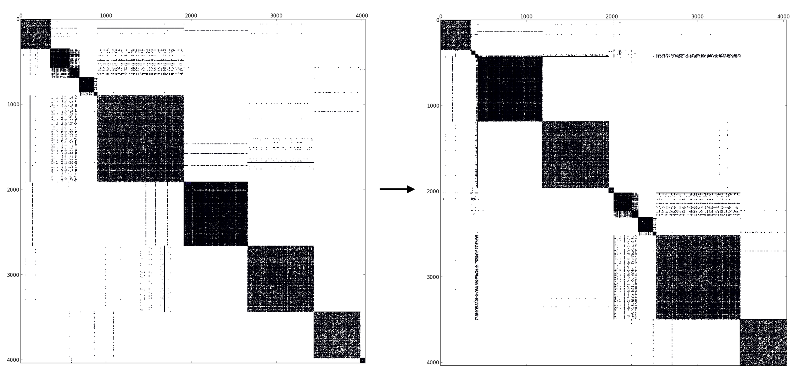

# SPARC: Sparse PAgeRank in C++

The SPARC package is an educational tool for solving the sparse page rank problem using spectral bisection, graph coarsening, and compact sparse column (CSC) format. To aid in documentation, usage, and installation, please see the related pages:

- [Installation and Usage](http://users.oden.utexas.edu/~gopal/software/sparc/html/install.html) or see below for a brief overview
- [Results & Documentation](https://users.oden.utexas.edu/~gopal/software/sparc/sparc.pdf)

## Reporting Comments and Bugs
Please [raise an issue](https://help.github.com/en/github/managing-your-work-on-github/creating-an-issue) in this repo.

## Example Results
Below are results obtained using SPARC.

The figure on the left is original data from facebook that has 88234 non-zero entries and 16466 number of non-zero entries on the off diagonal. The figure on the left is the same data after spectral bisection. The number of off diagonal entries reduces to 1266. 


The figure on the left is original DBLP data that has 1049866 non-zero entries and 628800 number of non-zero entries on the off diagonal. The figure on the left is the same data after spectral bisection. The number of off diagonal entries reduces to 350038. 


The figure on the left is the same original DBLP data as above with 1049866 non-zero entries and 628800 number of non-zero entries on the off diagonal. The figure on the left is the data after four levels of coarsening followed by spectral bisection. The number of off diagonal entries reduces to 523194.


Lastly, the figure below shows initial data undergoing three levels of coarsening and then spectral bisection followed by reordering. The number of off diagonal non zeros reduced from 830 to 482.


## Installation
### Package requirements

1. ARPACK
2. SuperLU
3. Boost

### Installation and Usage

First clone this repo:

```
git clone https://github.com/timothyas/sparc.git
```

SPARC can easily be built on either Stampede 2 (KNL) or on the desktops at the Oden Institute.

#### Install on Oden Institute Desktops
To build on the Oden Institute Machines first load gcc and boost module, 

```
module load gcc boost
```

Then issue a `make dep` to build all external dependencies: 

```
make dep
```

Run the test suite by issuing a `make check` command. 

```
make check 
```

All unit tests should pass if built correctly. Lastly, issue a `make install` to build the code in the src/
directory. 

```
make install
```

#### Install on Stampede 2, KNL Nodes
To build the code on Stampede 2, first load the gcc, mkl, and boost modules. 

```
module load gcc mkl boost
```

The follow the same steps above but use MakefileKNL, i.e,

```
make -f MakefileKNL [options]
```

### Running the code
To run the code, cd into the src/ directory and run `./sparc` to display the help message. A typical run might be: 

```
cd src/
./sparc -f ../data/facebook_combined.txt -c 4 -p 2 
```

This will run the facebook data with 4 levels of coarsening on 2 threads. The data directory contains more test cases.
Note that VinFile.dat in src/ directory should contain information for the teleportation vector for each dataset. The default is
for the facebook data; to change it do the DBLP data, simply run `cp VinFileUniformDBLP.dat VinFile.dat` for example. 


